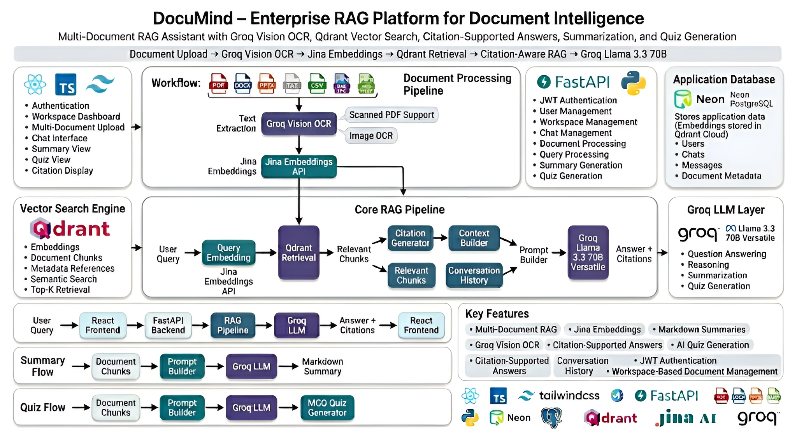
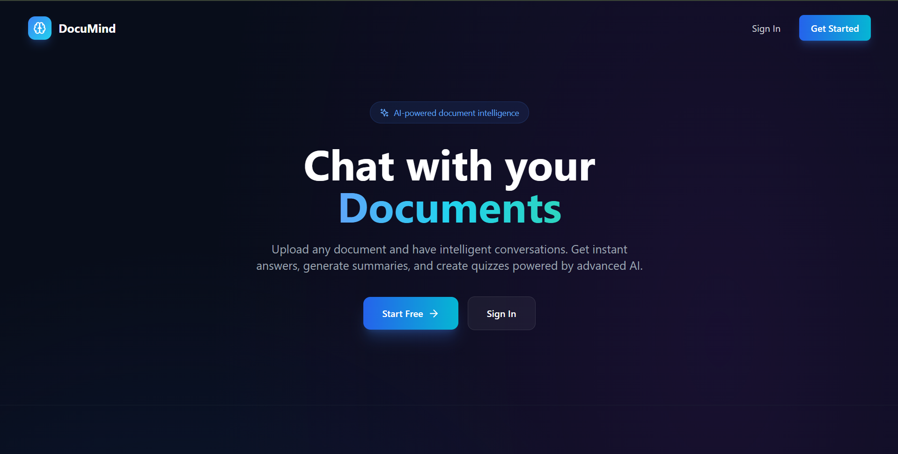
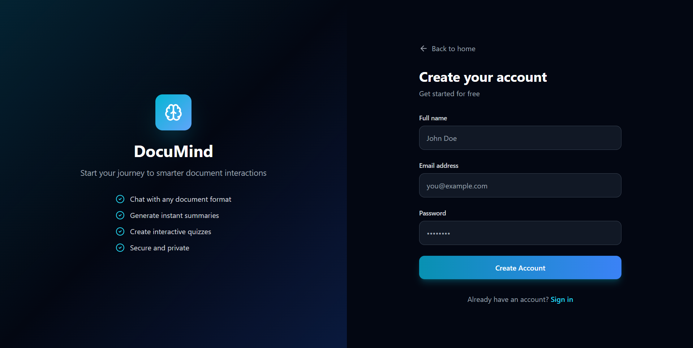
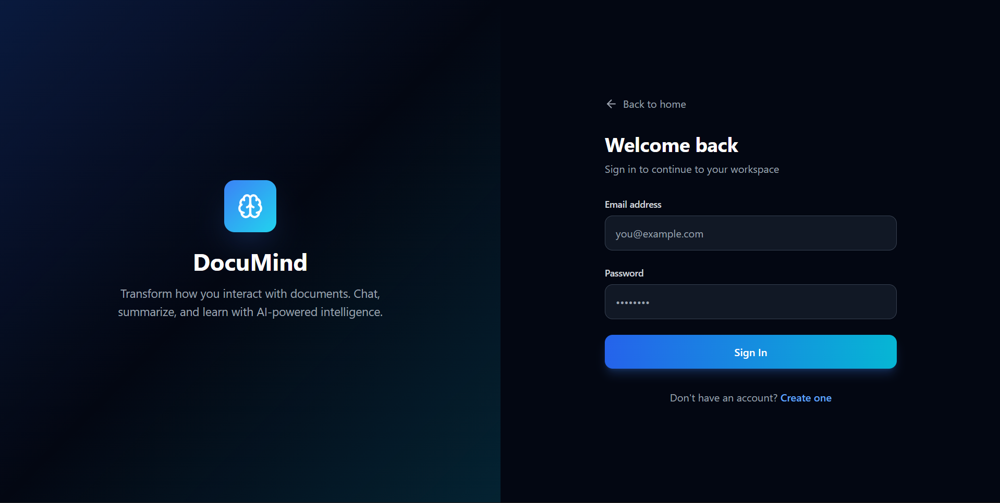
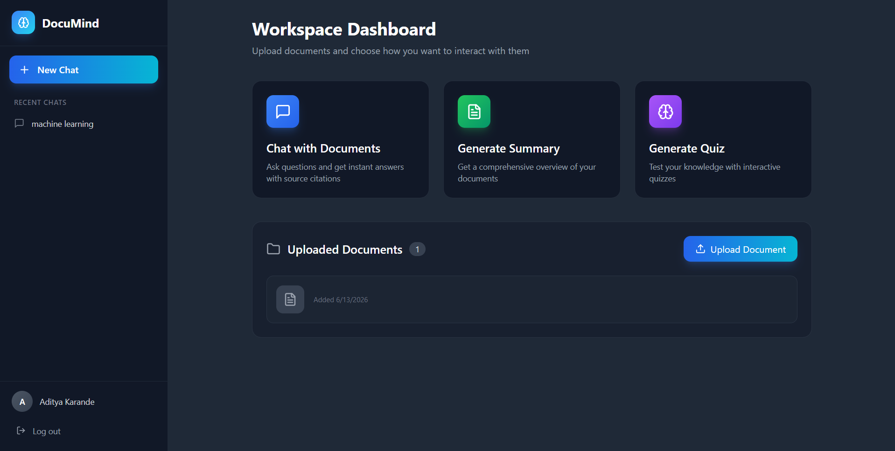
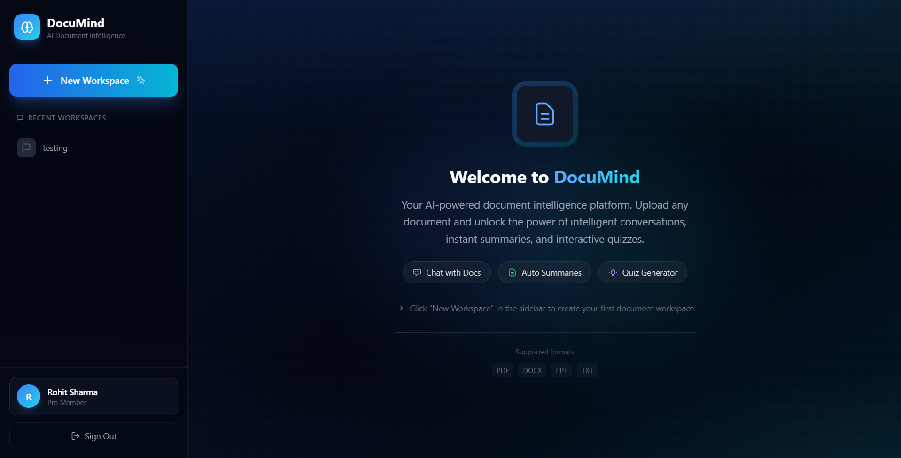
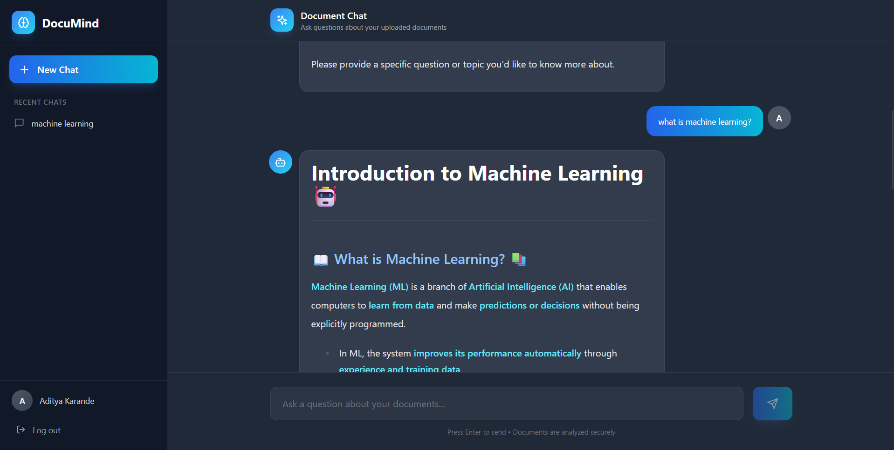
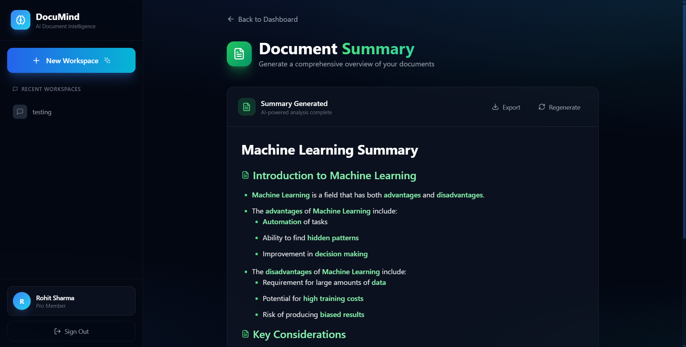
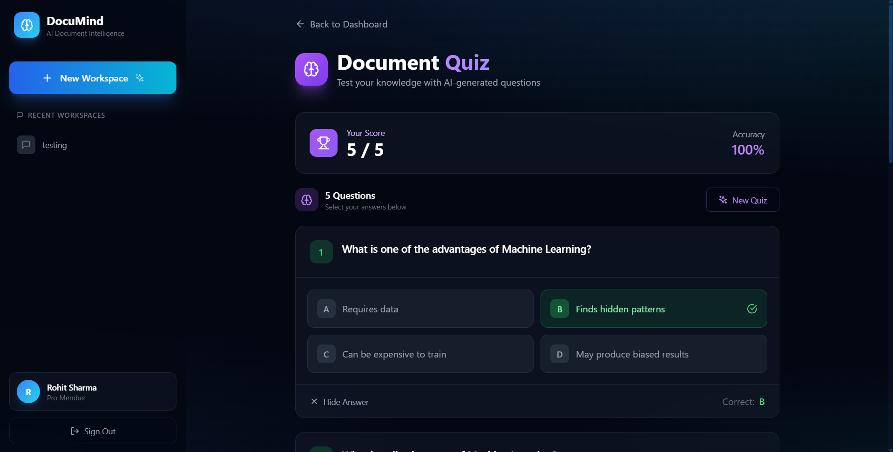
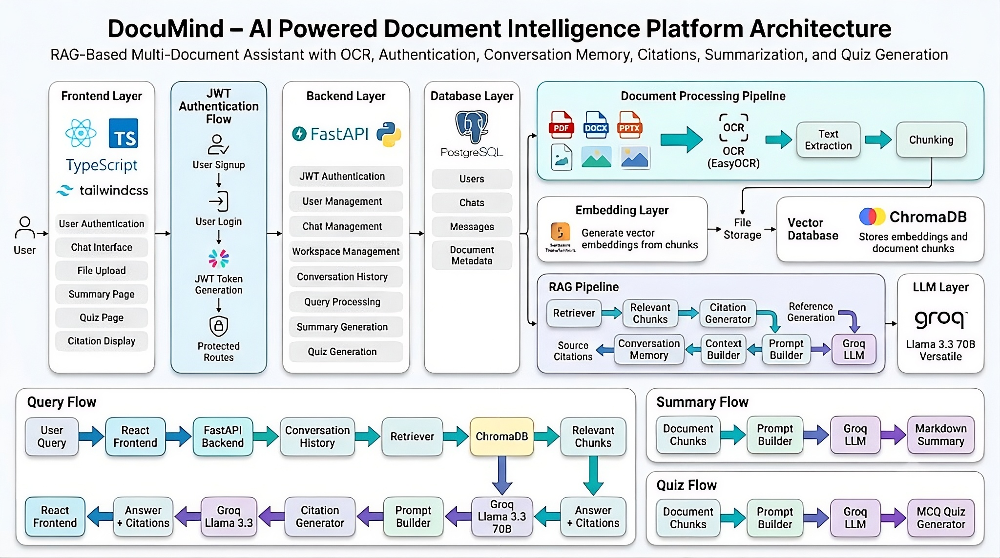

# 🧠 DocuMind - AI Powered Document Intelligence Platform

> A RAG-based multi-document assistant that enables users to upload PDFs, DOCX, PPTX, and image-based documents, ask questions, generate summaries, create quizzes, and receive citation-supported answers using modern AI technologies.



---

## 🔗 Links

🌐 Live Demo: [VERCEL_URL](https://docu-mind-six-dun.vercel.app/)

⚙️ Backend API: [RENDER_URL](https://documind-backend-nwin.onrender.com/)

📖 API Documentation: [RENDER_URL/docs](https://documind-backend-nwin.onrender.com/docs)

🎥 Demo Video: [GOOGLE_DRIVE_LINK](https://drive.google.com/file/d/14SnvNDDPAa8QfxJDFi3YOU9MuwF3y_uC/view?usp=drive_link)

---

## 🚀 Features

### 📄 Multi-Document Upload
- Upload multiple documents into a workspace.
- Supports:
  - PDF
  - DOCX
  - PPTX
  - Images

### 🔍 Intelligent Document Search
- Ask natural language questions about uploaded documents.
- Semantic search using vector embeddings.
- Retrieves only the most relevant chunks.

### 🧠 Retrieval-Augmented Generation (RAG)
- Context-aware question answering.
- Uses retrieved document chunks to generate accurate responses.
- Reduces hallucinations by grounding answers in source documents.

### 📚 Source Citations
- Displays document references used to generate answers.
- Helps users verify information directly from source documents.

### 📝 AI Summary Generation
- Generates structured markdown summaries.
- Covers all important topics and key concepts.
- Student-friendly format.

### 🎯 Quiz Generation
- Automatically creates multiple-choice questions from uploaded documents.
- Useful for revision and self-assessment.

### 💬 Conversation Memory
- Maintains chat history for each workspace.
- Context-aware conversations.

### 🔐 Authentication & Authorization
- User Signup/Login
- JWT Authentication
- Protected API Routes
- User-specific workspaces and chat history

### 🖼 OCR Support
- Extracts text from:
  - Scanned PDFs
  - Images
  - Screenshots
  - Image-Based Documents
- Powered by Groq Vision OCR.
- Supports cloud-based OCR without local OCR models.

---

# 🏗 Architecture

The system follows a layered architecture:

```text
Frontend (React + TypeScript)
        │
        ▼
Backend (FastAPI)
        │
 ┌──────┼─────────────┐
 ▼                    ▼
Neon PostgreSQL   Document Processing
                       │
                       ▼
                Groq Vision OCR
                       │
                       ▼
                Text Extraction
                       │
                       ▼
                    Chunking
                       │
                       ▼
              Jina Embeddings API
                       │
                       ▼
                 Qdrant Cloud
                       │
                       ▼
                 Qdrant Retriever
                       │
                       ▼
                Relevant Chunks
                       │
                       ▼
               Citation Generator
                       │
                       ▼
                 Context Builder
                       │
                       ▼
              Conversation History
                       │
                       ▼
                 Prompt Builder
                       │
                       ▼
         Groq Llama 3.3 70B Versatile
                       │
                       ▼
             Answer + Citations
```

---

# ⚙️ Tech Stack

## Frontend

- React
- TypeScript
- Tailwind CSS
- React Router
- Axios
- React Markdown

## Backend

- FastAPI
- SQLAlchemy
- Alembic
- JWT Authentication
- Pydantic

## AI / RAG Stack

- LangChain
- RecursiveCharacterTextSplitter
- Jina Embeddings API
- Qdrant Cloud
- Groq API
- Llama 3.3 70B Versatile

## OCR & Document Processing

- Groq Vision OCR
- PyMuPDF
- docx2txt
- python-pptx
- unstructured

## Databases

### Neon PostgreSQL

Stores:

- Users
- Chats
- Messages
- Document Metadata

### Qdrant Cloud

Stores:

- Embeddings
- Document Chunks
- Metadata References

---

# 🔄 RAG Pipeline

```text
User Query
      │
      ▼
Query Embedding
(Jina Embeddings API)
      │
      ▼
Qdrant Retrieval
      │
      ▼
Relevant Chunks
      │
      ▼
Citation Generator
      │
      ▼
Context Builder
      │
      ▼
Conversation History
      │
      ▼
Prompt Builder
      │
      ▼
Groq Llama 3.3 70B Versatile
      │
      ▼
Answer + Citations
```

---

# 📦 Document Processing Pipeline

```text
PDF / DOCX / PPTX / TXT / Images
               │
               ▼
       Groq Vision OCR
               │
               ▼
       Text Extraction
               │
               ▼
           Chunking
               │
               ▼
     Jina Embeddings API
               │
               ▼
         Qdrant Cloud
```

---

# 📸 Screenshots

## Homepage



---

## Sign Up



---

## Sign In



---

## Dashboard



---

## New Workspace



---

## Document Query



---

## Summary Generation



---

## Quiz Generation



---

## System Architecture



---

# 🗂 Project Structure

```text
DocuMind/
│
├── backend/
│   ├── app/
│   ├── rag_env/
│   └── requirements.txt
│
├── frontend/
│   ├── src/
│   ├── public/
│   └── package.json
│
├── screenshots/
│   ├── DocuMind_homepage.png
│   ├── DocuMind_signup.png
│   ├── DocuMind_signin.png
│   ├── DocuMind_dashboard.png
│   ├── DocuMind_new_chat.png
│   ├── DocuMind_query.png
│   ├── DocuMind_summary.png
│   ├── DocuMind_quiz.png
│   └── DocuMind_architecture.jpeg
│
├── README.md
│
└── .gitignore
```

---

# 🛠 Installation

## Clone Repository

```bash
git clone https://github.com/Aditya-Karande/DocuMind.git

cd DocuMind
```

---

## Backend Setup

```bash
cd backend

python -m venv rag_env

rag_env\Scripts\activate

pip install -r requirements.txt
```

### Configure Environment Variables

Create a `.env` file:

```env
GROQ_API_KEY=your_groq_api_key

JINA_API_KEY=your_jina_api_key

DATABASE_URL=your_neon_database_url

QDRANT_URL=your_qdrant_url

QDRANT_API_KEY=your_qdrant_api_key

JWT_SECRET_KEY=your_jwt_secret_key
```

---

### Run Backend

```bash
cd app

uvicorn main:app --reload
```

Backend:

```text
http://localhost:8000
```

Swagger Docs:

```text
http://localhost:8000/docs
```

---

## Frontend Setup

```bash
cd frontend

npm install

npm run dev
```

Frontend:

```text
http://localhost:5173
```

---

# 🔐 Authentication Flow

```text
User Signup
      │
      ▼
User Login
      │
      ▼
JWT Token Generation
      │
      ▼
Protected Routes
```

---

# 🌟 Future Improvements

- Web Search Integration
- Hybrid Search (Keyword + Semantic)
- Multi-Modal RAG
- Team Workspaces
- Document Sharing
- Streaming Responses
- Voice-Based Queries
- Advanced Analytics Dashboard
- PDF Annotation Support

---

# 👨‍💻 Author

**Aditya Karande**

AI & Data Science Engineering Student

Built with:

- React + TypeScript
- FastAPI
- Neon PostgreSQL
- Qdrant Cloud
- Jina Embeddings API
- Groq Vision OCR
- Groq Llama 3.3 70B Versatile

---

# ⭐ Support

If you found this project useful, consider giving it a star on GitHub.

⭐ Star the repository
🍴 Fork the repository
📢 Share it with others